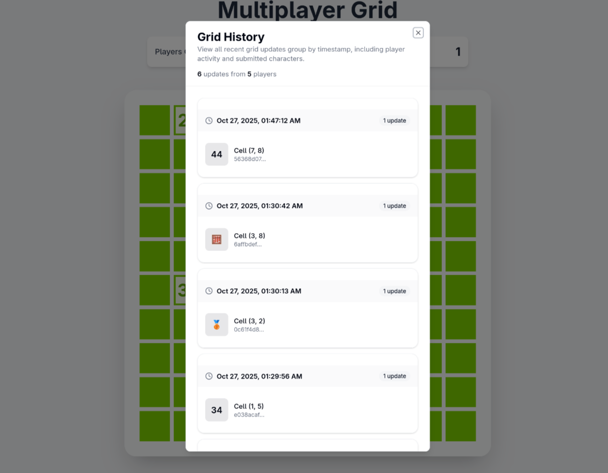
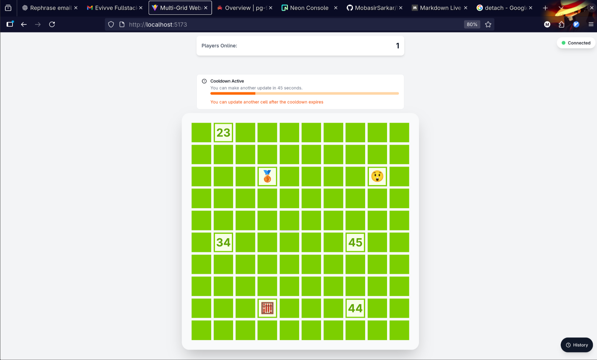
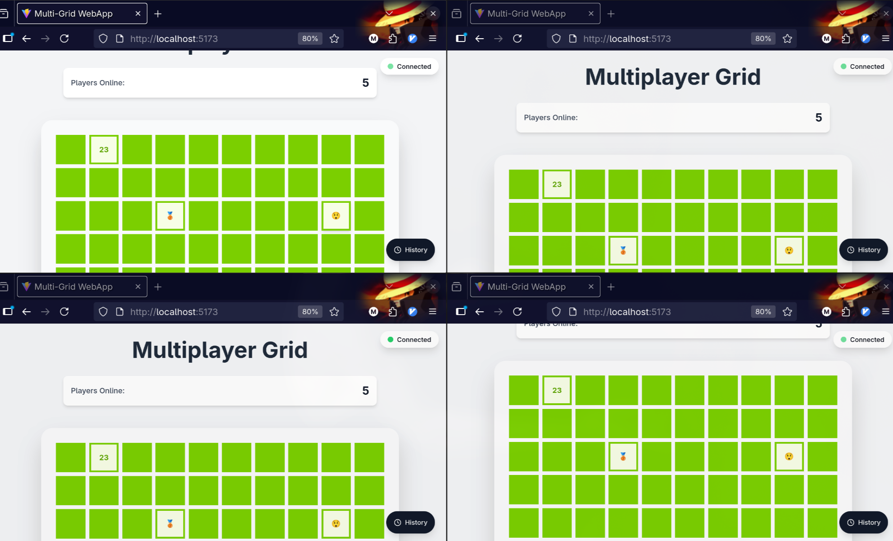

# Multi Grid Game

## About
Multi Grid is a real-time multiplayer grid game where:

- Once a player submits a character in a block, they cannot update any block again until the cooldown expires.
- Players can see how many other players are currently online.
- The grid updates in real-time for all connected players.

### Extra Features
- **Historical Updates**: Players can view past updates to the grid.


## Preview

<p align="center">
  
  
  
</p>

---

## Prerequisites
- Docker  
- Docker Compose  

## Setup
1. Copy `.env.example` to `.env` in **both** the client and server directories and update if needed:
   cp .env.example .env

2. Run the application with Docker:

```bash
   docker-compose up --build
   ```
**detach mode**
```bash
   docker-compose up --build -d
```

- Client: http://localhost:5173  
- Server: http://localhost:8000

## AI Tools Used
 - Normal Chatgpt for bug fixes.


